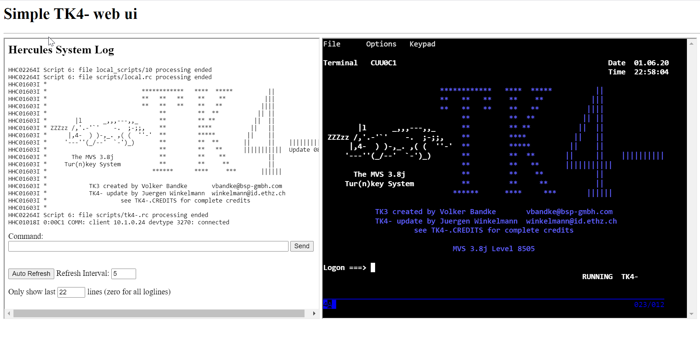

# TK4-K8s

Juergen Winkelmann's TK4- distribution, but on Kubernetes!

This distribution includes a small web-based UI and a web-based TN3270 client based on shellinabox

## Instructions

for amd64:

    kubectl apply -f deployment/amd64.yaml

for arm64:

    kubectl apply -f deployment/arm64.yaml

## Screenshots

